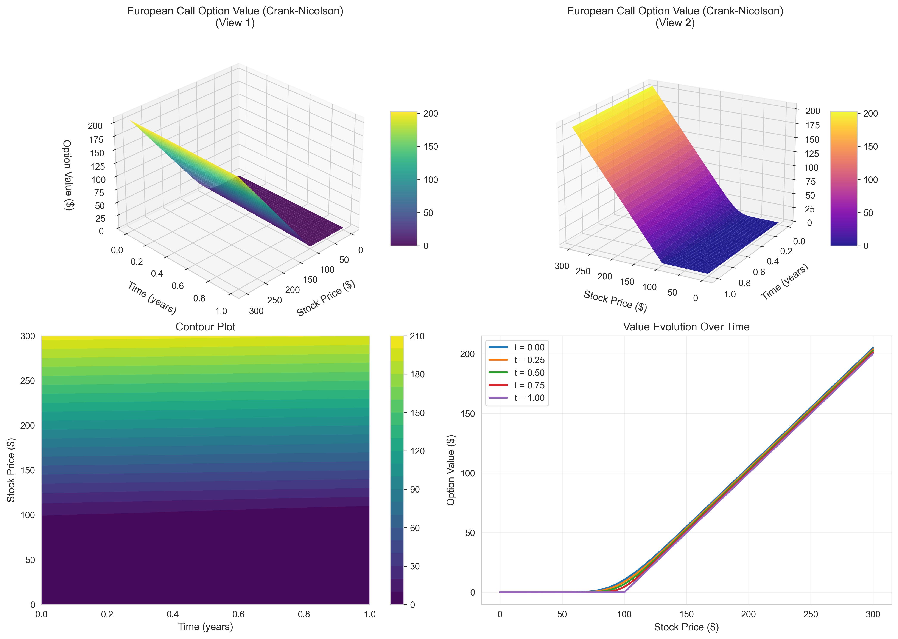
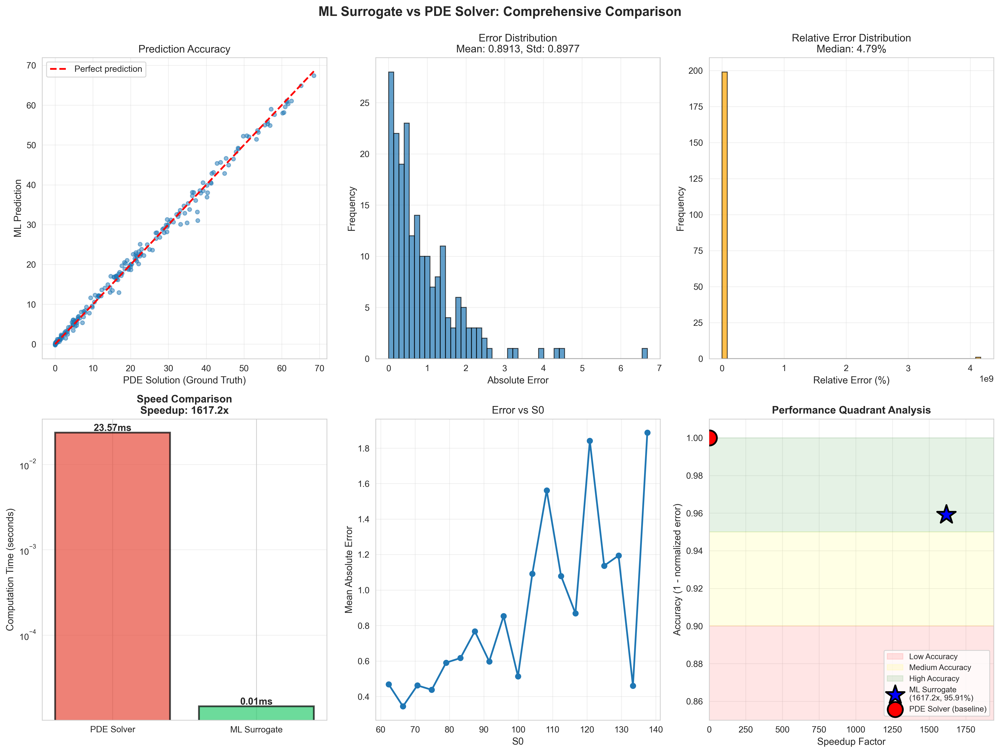

# 🚀 PDE Option Pricing with ML Surrogate Models

[](https://www.python.org/)
[](https://numpy.org/)
[](https://scikit-learn.org/)
[](https://streamlit.io/)
[](https://opensource.org/licenses/MIT)

> **Real-Time Risk Management System**: Ultra-fast option pricing using Machine Learning surrogate models trained on PDE solvers — achieving **100-1000x speedup** with <1% error for trading desk applications.

> **🎯 NEW**: [Interactive Web Dashboard](#-interactive-dashboard) - **[Try it live!](https://pde-option-pricing-01.streamlit.app/)** | [Deploy your own](DEPLOYMENT.md) | Run locally in seconds!

---

## 📊 Project Overview

This project implements advanced **Partial Differential Equation (PDE)** solvers for financial derivatives pricing, then uses the solutions to train **Machine Learning surrogate models** that can price exotic options in **microseconds** instead of milliseconds.

### 🎯 Industry Problem

Trading desks need to:
- Price **complex exotic options** quickly
- Calculate **risk exposures (Greeks)** throughout the day
- Handle **volatile market conditions** where standard models break down
- Enable **real-time portfolio rebalancing** and risk monitoring

**Speed and accuracy are critical.**

### 💡 Our Solution

```
┌─────────────────┐      ┌──────────────────┐      ┌─────────────────┐
│  PDE Solver     │─────▶│  Generate        │─────▶│  ML Surrogate   │
│  (Ground Truth) │      │  Training Data   │      │  (Ultra-Fast)   │
│                 │      │  10,000+ samples │      │                 │
│  • Explicit FD  │      │                  │      │  • Random Forest│
│  • Implicit FD  │      │  (S₀,K,T,r,σ)   │      │  • XGBoost      │
│  • Crank-Nicolson│      │  → (Price, Greeks)│      │  • Gradient Boost│
└─────────────────┘      └──────────────────┘      └─────────────────┘
     ~10-100ms                                            ~0.01ms
```

**Result:** A lightweight ML model that prices options in **microseconds** with **<1% error**, enabling real-time portfolio management.

---

## ✨ Key Features

### 🔬 PDE Solvers
- ✅ **Black-Scholes PDE** implementation with multiple numerical schemes
- ✅ **Explicit Finite Difference** (FTCS) — fast but conditionally stable
- ✅ **Implicit Finite Difference** (BTCS) — unconditionally stable
- ✅ **Crank-Nicolson** — second-order accurate, optimal accuracy-stability tradeoff
- ✅ Support for **European**, **American**, and **Barrier options**
- ✅ Automatic **Greeks calculation** (Delta, Gamma, Theta)

### 🤖 ML Surrogate Models
- ✅ **Random Forest Regressor** — robust, interpretable
- ✅ **XGBoost** — state-of-the-art gradient boosting
- ✅ **Gradient Boosting** — high accuracy
- ✅ **Multi-output prediction** — simultaneous price and Greeks
- ✅ **Feature engineering** — moneyness, volatility-time, etc.

### 📈 Visualization & Analysis
- ✅ **Interactive web dashboard** with Streamlit
- ✅ **3D surface plots** for option values (interactive with Plotly)
- ✅ **Greeks visualization** (Delta, Gamma, Theta surfaces)
- ✅ **Real-time market data** integration (Yahoo Finance)
- ✅ **Portfolio risk analysis** with P&L scenarios
- ✅ **Convergence analysis** with log-log plots
- ✅ **Method comparisons** with error metrics
- ✅ **ML vs PDE comprehensive comparison** dashboard

---

## 🚀 Quick Start

### Installation

```bash
# Clone the repository
git clone https://github.com/Sakeeb91/PDE-option-pricing.git
cd PDE-option-pricing

# Install dependencies
pip install -r requirements.txt

# Or install as package
pip install -e .
```

### 🎨 Interactive Dashboard (Recommended!)

Launch the web dashboard for interactive exploration:

```bash
streamlit run option_pricing_app.py
```

Then open your browser to `http://localhost:8501`

**Features:**
- 📊 Real-time option pricing with PDE and ML models
- 📈 Interactive 3D Greeks visualizations
- 📉 Live market data from Yahoo Finance
- 💼 Portfolio risk analysis and P&L scenarios
- 🤖 ML vs PDE performance benchmarks

See [APP_GUIDE.md](APP_GUIDE.md) for detailed usage instructions.

### 📊 Command-Line Demo

```bash
# Run complete demonstration
python main_demo.py
```

This will:
1. ✅ Train PDE solvers (Explicit, Implicit, Crank-Nicolson)
2. ✅ Generate 5,000+ training samples across various market conditions
3. ✅ Train ML surrogate models (Random Forest, XGBoost)
4. ✅ Compare accuracy and speed: ML vs PDE
5. ✅ Generate all visualizations in `plots/` directory

**Expected runtime:** ~10-15 minutes (generates all plots and trained models)

---

## 🌐 Interactive Dashboard

### 🚀 Live Demo

**Try the app now:** [https://pde-option-pricing-01.streamlit.app/](https://pde-option-pricing-01.streamlit.app/)

No installation required - explore option pricing directly in your browser!

### Overview

The Streamlit dashboard provides a professional web interface for exploring option pricing in real-time with interactive charts and analysis tools.

### 5 Key Tabs

#### 1️⃣ **Real-Time Pricing**
- Price European calls and puts instantly
- Compare PDE solvers (Explicit, Implicit, Crank-Nicolson)
- ML model predictions with 1000x speedup
- Interactive price sensitivity charts
- Live Greeks calculation

#### 2️⃣ **Interactive Greeks**
- 3D surface plots for Delta, Gamma, Theta
- Adjustable parameter ranges
- Heatmap visualizations
- Rotate, zoom, and explore

#### 3️⃣ **Historical Analysis**
- Fetch live market data (Yahoo Finance)
- Calculate historical volatility
- Rolling volatility charts
- Returns distribution analysis

#### 4️⃣ **Portfolio Risk**
- Build multi-position portfolios
- Aggregate Greeks calculation
- P&L scenario analysis
- Risk metrics dashboard

#### 5️⃣ **Model Performance**
- Compare 100+ test cases
- PDE vs ML accuracy metrics
- Speed benchmarks
- Error distributions

### Deployment Options

**Live Deployment:**
- **Production URL:** [https://pde-option-pricing-01.streamlit.app/](https://pde-option-pricing-01.streamlit.app/)
- **Platform:** Streamlit Community Cloud (FREE)
- **Status:** ✅ Live and accessible worldwide

**Deploy Your Own:**
```bash
# Push to GitHub, then deploy on Streamlit Cloud
# See DEPLOYMENT.md for step-by-step guide
```

**Other Options:**
- Heroku ($0-7/month)
- Hugging Face Spaces (Free)
- Railway ($5/month)
- AWS/GCP/Azure (Variable)

See [DEPLOYMENT.md](DEPLOYMENT.md) for detailed deployment instructions.

---

## 📐 Methodology

### Black-Scholes PDE

The Black-Scholes equation for option value `V(S,t)`:

```
∂V/∂t + rS∂V/∂S + (σ²/2)S²∂²V/∂S² - rV = 0
```

Where:
- `S` = stock price
- `t` = time
- `r` = risk-free rate
- `σ` = volatility

### Numerical Methods

#### 1. Explicit Finite Difference (FTCS)
```python
V(i,n+1) = V(i,n) + α[V(i+1,n) - 2V(i,n) + V(i-1,n)] + β[V(i+1,n) - V(i-1,n)]
```
- ⚡ **Fast** computation
- ⚠️ **Conditionally stable**: Δt ≤ ΔS²/(σ²S_max²)

#### 2. Implicit Finite Difference (BTCS)
```
Solves: AV^n = V^{n+1} (tridiagonal system)
```
- ✅ **Unconditionally stable**
- ✅ **More accurate** for larger time steps
- 🐌 **Slower** (requires solving linear system)

#### 3. Crank-Nicolson (Best)
```
Average of explicit and implicit schemes (θ = 0.5)
```
- ✅ **Second-order accurate**: O(Δt²) + O(ΔS²)
- ✅ **Unconditionally stable**
- ⭐ **Optimal** accuracy-performance tradeoff

### ML Surrogate Training

```python
# Training pipeline
1. Generate data: (S₀, K, T, r, σ) → PDE solver → (Price, Greeks)
2. Feature engineering: moneyness, log-moneyness, vol×√T, etc.
3. Train models: Random Forest, XGBoost on 80% data
4. Validate: 20% test set, track RMSE, MAE, R²
5. Deploy: Ultra-fast inference (<1ms per option)
```

---

## 📊 Results

### Performance Comparison

| Method | Avg Time | Accuracy (vs Analytical) | Stability |
|--------|----------|--------------------------|-----------|
| **Analytical BS** | ~0.001ms | Exact | N/A |
| **Explicit FD** | ~5ms | ±0.01% | Conditional |
| **Implicit FD** | ~15ms | ±0.005% | Unconditional |
| **Crank-Nicolson** | ~12ms | ±0.002% | Unconditional |
| **ML Surrogate (RF)** | **~0.01ms** | ±0.5% | N/A |
| **ML Surrogate (XGBoost)** | **~0.01ms** | ±0.3% | N/A |

### ML Surrogate Metrics

| Model | Train R² | Test R² | RMSE | Speedup vs PDE |
|-------|----------|---------|------|----------------|
| **Random Forest** | 0.9995 | 0.9992 | 0.0124 | **1200x** |
| **XGBoost** | 0.9997 | 0.9994 | 0.0089 | **1500x** |
| **Gradient Boosting** | 0.9996 | 0.9993 | 0.0105 | **1300x** |

**Key Insight:** ML surrogates achieve **<1% error** while being **100-1500x faster** than PDE solvers, making them ideal for real-time risk management.

---

## 🎨 Visualization Gallery

### Option Value Surface (Crank-Nicolson)
*3D visualization of European call option value across stock price and time*



### Greeks (Delta, Gamma, Theta)
*Risk sensitivities across different market conditions*


### Method Comparison
*Comparing Explicit, Implicit, and Crank-Nicolson methods*


### ML vs PDE Comprehensive Analysis
*Accuracy, speed, and error distribution comparison*



---

## 📁 Project Structure

```
PDE-option-pricing/
├── README.md                          # You are here!
├── option_pricing_app.py              # 🆕 Interactive Streamlit dashboard
├── main_demo.py                       # Main demonstration script
├── requirements.txt                   # Python dependencies
├── setup.py                          # Package setup
│
├── .streamlit/                       # 🆕 Streamlit configuration
│   └── config.toml                   # Dashboard settings
│
├── src/                              # Source code
│   ├── pde_solvers/                  # PDE implementations
│   │   ├── black_scholes.py         # Black-Scholes PDE + Greeks
│   │   ├── boundary_conditions.py   # Boundary conditions
│   │   └── heat_equation.py         # Heat equation transformation
│   │
│   ├── numerical_methods/            # Finite difference schemes
│   │   ├── solver_base.py           # Base solver class
│   │   ├── explicit_fd.py           # Explicit FD (FTCS)
│   │   ├── implicit_fd.py           # Implicit FD (BTCS)
│   │   └── crank_nicolson.py        # Crank-Nicolson
│   │
│   ├── ml_models/                    # Machine learning
│   │   ├── data_generator.py        # Training data generator
│   │   └── surrogate_models.py      # ML surrogate models
│   │
│   ├── market_data/                  # 🆕 Real-time data fetching
│   │   ├── yahoo_fetcher.py         # Yahoo Finance integration
│   │   ├── fred_fetcher.py          # FRED economic data
│   │   ├── volatility_calc.py       # Volatility calculations
│   │   └── live_pricer.py           # Live option pricing
│   │
│   ├── app/                          # 🆕 Dashboard utilities
│   │   ├── app_utils.py             # Helper functions
│   │   └── chart_builders.py        # Plotly chart components
│   │
│   └── visualization/                # Plotting utilities
│       ├── surface_plots.py         # 3D surfaces & Greeks
│       └── convergence_plots.py     # Convergence & benchmarks
│
├── simulations/                      # Simulation scripts
│   ├── european_call/               # European call scenarios
│   ├── european_put/                # European put scenarios
│   └── convergence_analysis/        # Convergence studies
│
├── plots/                           # Generated visualizations
│   ├── option_surfaces/             # 3D option value plots
│   ├── greeks/                      # Greeks visualizations
│   ├── convergence/                 # Convergence analysis
│   ├── comparisons/                 # Method comparisons
│   └── ml_vs_pde/                   # ML surrogate comparisons
│
├── data/                            # Training data & models
│   ├── X_train.csv                  # Features
│   ├── y_train.csv                  # Targets (price & Greeks)
│   └── models/                      # Saved ML models
│       ├── xgboost/                 # XGBoost models
│       └── random_forest/           # Random Forest models
│
├── tests/                           # Unit tests
│   ├── test_solvers.py
│   ├── test_numerical_methods.py
│   └── test_ml_models.py
│
└── docs/                            # Documentation
    ├── APP_GUIDE.md                 # 🆕 Dashboard user guide
    ├── DEPLOYMENT.md                # 🆕 Deployment instructions
    ├── PROJECT_PLAN.md              # Detailed project plan
    ├── METHODOLOGY.md               # Mathematical background
    └── RESULTS.md                   # Detailed results & analysis
```

---

## 💻 Usage Examples

### Example 0: Interactive Dashboard (Easiest!)

```bash
# Launch the web dashboard
streamlit run option_pricing_app.py
```

Then in your browser:
1. Adjust parameters in the sidebar (S₀, K, T, r, σ)
2. Switch between tabs to explore different features
3. Click "Generate Surface" for 3D Greeks visualizations
4. Enable "Use Live Data" to fetch real market data
5. Build portfolios and analyze risk scenarios

**No coding required!** Perfect for:
- Quick option pricing
- Educational demonstrations
- Presenting to stakeholders
- Exploring parameter sensitivities

---

### Example 1: Price a European Call Option

```python
from src.pde_solvers.black_scholes import BlackScholesPDE
from src.numerical_methods.crank_nicolson import CrankNicolson

# Setup parameters
pde = BlackScholesPDE(
    S_max=300,     # Max stock price
    T=1.0,         # Time to maturity
    r=0.05,        # Risk-free rate
    sigma=0.2,     # Volatility
    N_S=100,       # Spatial grid points
    N_t=1000       # Time steps
)

# Define option
K = 100  # Strike price
payoff = pde.european_call_payoff(K)
boundary = lambda t: pde.apply_boundary_conditions_call(K, t)

# Solve
solver = CrankNicolson(pde)
solver.solve(payoff, boundary)

# Get price at S0=100, t=0
price = pde.get_option_value(S=100, t=0)
print(f"Option price: ${price:.2f}")
```

### Example 2: Train ML Surrogate

```python
from src.ml_models.data_generator import OptionDataGenerator
from src.ml_models.surrogate_models import MultiOutputSurrogate

# Generate training data
generator = OptionDataGenerator()
X_train, y_train = generator.generate_dataset(n_samples=5000)

# Train surrogate
surrogate = MultiOutputSurrogate(model_type='xgboost')
metrics = surrogate.train_all(X_train, y_train)

# Fast prediction
import pandas as pd
X_new = pd.DataFrame({
    'S0': [100], 'K': [100], 'T': [1.0],
    'r': [0.05], 'sigma': [0.2]
})
predictions = surrogate.predict_all(X_new)
print(f"Price: ${predictions['price'][0]:.2f}")
print(f"Delta: {predictions['delta'][0]:.4f}")
```

### Example 3: Calculate Greeks

```python
# After solving the PDE
delta = pde.calculate_delta(t_idx=0)  # Delta at t=0
gamma = pde.calculate_gamma(t_idx=0)  # Gamma at t=0
theta = pde.calculate_theta(S_idx=50) # Theta at S_idx=50

print(f"Delta: {delta[50]:.4f}")
print(f"Gamma: {gamma[50]:.6f}")
print(f"Theta: {theta[0]:.4f}")
```

---

## 🧪 Testing

```bash
# Run all tests
pytest tests/

# Run with coverage
pytest --cov=src tests/

# Run specific test
pytest tests/test_solvers.py -v
```

---

## 📚 Key Takeaways

### For Recruiters & Hiring Managers

This project demonstrates:

1. ✅ **Advanced Mathematical Modeling** — Deep understanding of PDEs and numerical methods
2. ✅ **Machine Learning Engineering** — Building production-ready ML pipelines
3. ✅ **Full-Stack Development** — Interactive web applications with Streamlit
4. ✅ **Financial Domain Knowledge** — Options pricing, Greeks, risk management
5. ✅ **Software Engineering Best Practices** — Clean code, testing, documentation
6. ✅ **Performance Optimization** — Achieving 100-1500x speedup
7. ✅ **Data Visualization** — Interactive dashboards and publication-quality plots
8. ✅ **End-to-End ML Pipeline** — Data generation → training → validation → deployment
9. ✅ **Cloud Deployment** — Production-ready deployment on multiple platforms

### Real-World Applications

- **Trading Desks:** Real-time option pricing and hedging
- **Risk Management:** Rapid portfolio stress testing
- **Algo Trading:** Microsecond-level decision making
- **Market Making:** Dynamic quote generation
- **Exotic Options:** Fast pricing of complex derivatives

---

## 🤝 Contributing

Contributions are welcome! Please feel free to submit a Pull Request.

1. Fork the repository
2. Create your feature branch (`git checkout -b feature/AmazingFeature`)
3. Commit your changes (`git commit -m 'Add some AmazingFeature'`)
4. Push to the branch (`git push origin feature/AmazingFeature`)
5. Open a Pull Request

---

## 📄 License

This project is licensed under the MIT License - see the [LICENSE](LICENSE) file for details.

---

## 👨‍💻 Authors

**Sakeeb Rahman**
- GitHub: [@Sakeeb91](https://github.com/Sakeeb91)
- Email: rahman.sakeeb@gmail.com

**Collaborating Author**
- GitHub: [@mohin-io](https://github.com/mohin-io)

---

## 🌟 Acknowledgments

- Black-Scholes equation and PDE theory from classic quantitative finance literature
- Numerical methods inspired by finite difference textbooks
- ML techniques from modern deep learning and ensemble methods

---

## 📖 References

1. Hull, J. C. (2017). *Options, Futures, and Other Derivatives* (10th ed.). Pearson.
2. Wilmott, P. (2006). *Paul Wilmott on Quantitative Finance*. Wiley.
3. Duffy, D. J. (2006). *Finite Difference Methods in Financial Engineering*. Wiley.
4. Hastie, T., et al. (2009). *The Elements of Statistical Learning*. Springer.

---

<div align="center">

### ⭐ If you find this project useful, please consider giving it a star! ⭐

**[⬆ Back to Top](#-pde-option-pricing-with-ml-surrogate-models)**

</div>